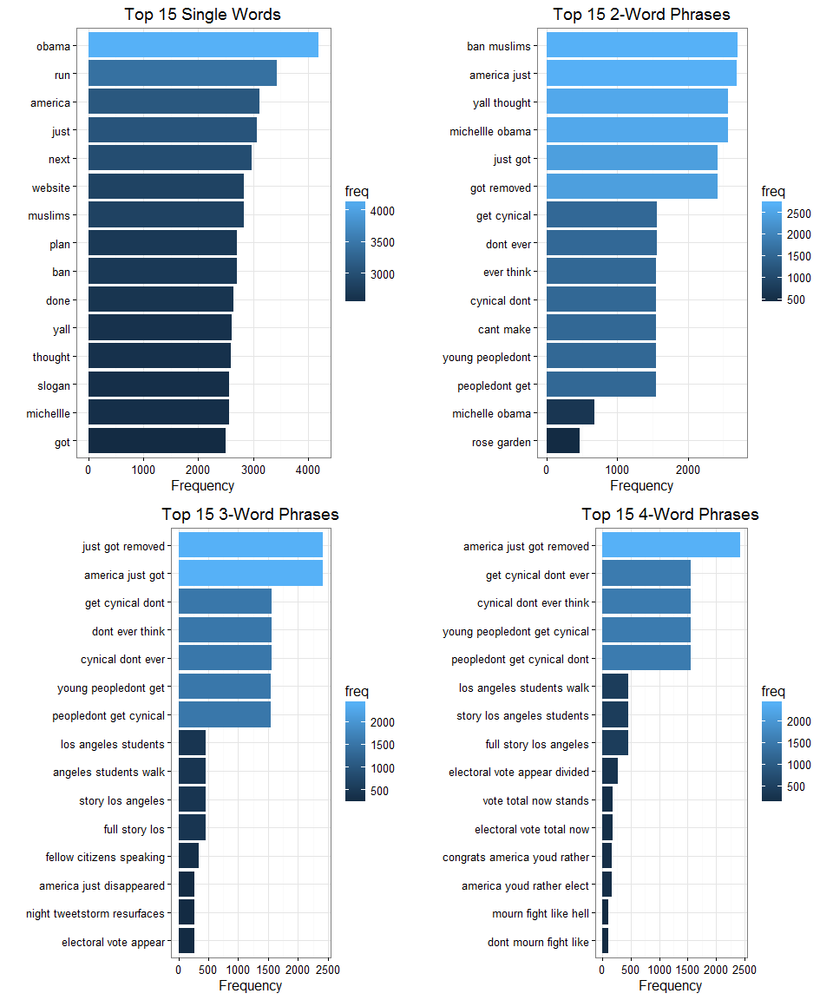
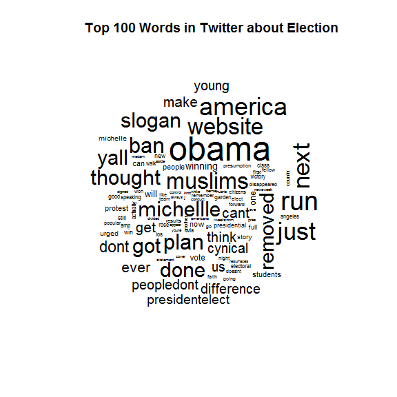

# A Sneak Peek at Twitter Data After Election
Yanfei Wu  
November 9, 2016  

Donald Trump just won the 2016 presidential election. It is a result that most of the polls failed to predict and the public are taking it in different ways. Here I did some word frequency analysis on 20,000 tweets that mentioned the presidential election from today, just a sneak peek of people's emotions, concerns, and so on. The results are shown below and the codes are available at [Github](https://github.com/yanfei-wu/ForFun/tree/master/Twitter_AfterElection).

The frequency plots are shown below:  

