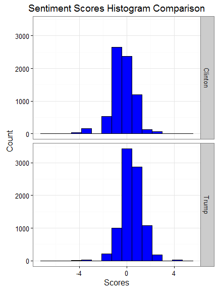
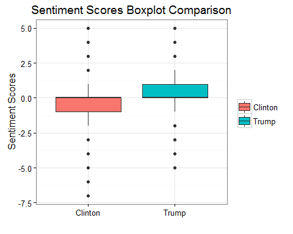
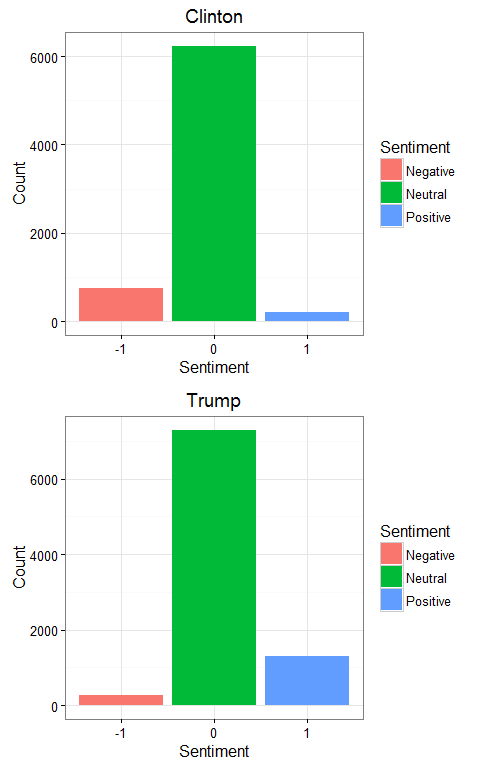
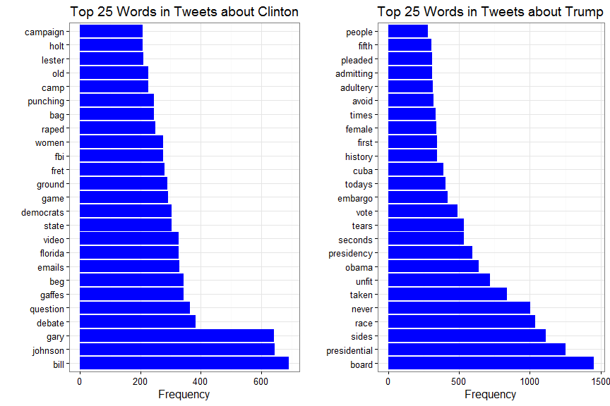
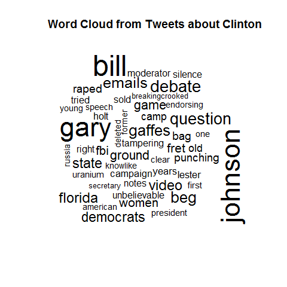
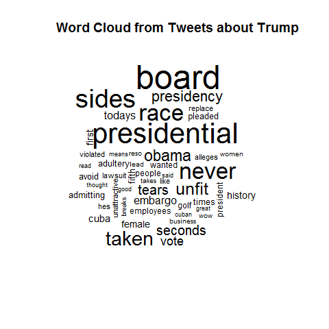

# Twitter Mining: Presidential Candidates 2016
Yanfei Wu  
September 29, 2016  

## Introduction  

The US presidential election of 2016 is in less than 2 months. After series of presidential primary elections and caucuses, businessman Donald Trump became the Republican Party's presidential nominee and former Secretary of State Hillary Clinton became the Democratic Party's presidential nominee. Before November, there are three presidential debates between Clinton and Trump. The first debate just took place several days ago on September 26th. 

In this post, I perform a sentiment analysis of the two candidates using tweets tweeted after the first debate. The most frequent words appearing in tweets about the two candiadtes are also shown in this post. All codes for this post can be found in [Github](https://github.com/yanfei-wu/ForFun/tree/master/Twitter_Presidential_Candidates).    

## Twitter Scraping   

20,000 tweets are collected using the two candidates' names as queries (10,000 tweets for each candidate) from Twitter. An additional filtering step is carried out to remove tweets containing both names since it is difficult to assign the sentiment scores calculated from these tweets to either candidate. As a result, there are 7179 tweets left with only Clinton's name and 8854 tweets left with only Trump's name. 

## Sentiment Analysis  

The sentiment scores are calculated using a lexicon-based method as proposed by Hu and Liu ([Link](https://www.cs.uic.edu/~liub/publications/kdd04-revSummary.pdf)). A [list](https://www.cs.uic.edu/~liub/FBS/sentiment-analysis.html#lexicon) of English positive and negative opinion words or sentiment words compiled by them are used. For simplicity, the numbers of positive words and negative words, as given by the list, in each tweet are compared and the difference is used to determine the option orientation or the sentiment score of each tweet.  

Note that before calculating the sentiment scores, the tweets are cleaned by removing punctuations, twitter characters (@ and #), and URLs.  

Now, let's look at the sentiment scores of both candidates.  

Clearly, **Clinton has more negative sentiment scores than Trump**, based on tweets used here. The scores are also used to divide the sentiment into 3 categoris below:  

* Positive(1): sentiment score >= 2  
* Neutral(0): -2 < sentiment score < 2  
* Negative(-1): sentiment score <= -2  

The distributions of positive, neutral, and negative sentiment for both candidates are shown below: 

Again, there seems to be more tweets about Clinton that are negative. But overall, **the majority of the tweets about both candidates are neutral**.   

## Word Frequency Analysis  

Another thing we can do is to find out the most frequent words appearing in the tweets about the two candidates. The first step is to construct corpus by compling the tweets. Then, the texts in the corpus are broken into tokens, i.e., single word. After tokenization, document-term matrix is created to describe the frequency of each word that occurs in the corpus. Note that some words are removed from this analysis such as the candidates' names, English stopwords, and some words like 'will', 'can', etc.  

The frequency plots are shown below:  

Words like 'Bill', 'Emails' appear in tweets about Clinton quite frequently, as expected. It also looks like a lot of tweets about Clinton also mention Gary Johnson. In tweets about Trump, some frequent words are 'race', 'Obama'.   

## Summary  

This post analyzes tweets tweeted after the first presidential debate about the two presidential candidates, Donald Trump and Hillary Clinton. Sentiment scores, defined as the difference between the number of positive words and that of the negative words based on the analyzed tweets shows a more positive sentiment towards Trump. The majority of the tweets, however, are neutral. The word frequency analysis shows frequent words like 'Bill', 'Emails' appearing in tweets about Clinton, and words like 'race', 'Obama' frequently showing up in tweets about Trump. 

